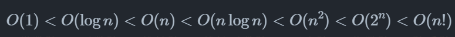

for while迭代循环 时间复杂度n  
嵌套循环 时间复杂度n方  
递归通常比迭代更加耗费内存空间  
递归通常比循环的时间效率更低  
普通递归：递归函数在return前实现  
尾递归：递归函数在return实现  
线性阶的时间复杂度记为O(n)

如何推算时间复杂度O：
1.统计操作数量
    1.忽略操作数量T(n)中的常数项
    2.省略所有系数
    3.嵌套循环时使用乘法
2.判断渐近上界

常数阶<对数阶<线性阶<线性对数阶<平方阶<指数阶<阶乘阶

