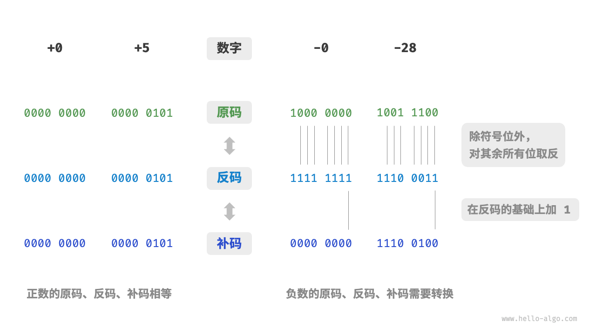

递归通常比迭代更加耗费内存空间  
递归通常比循环的时间效率更低  
普通递归：递归函数在return前实现  
尾递归：递归函数在return实现  
时间复杂度记为O()

如何推算时间复杂度O：
1.统计操作数量
    1.忽略操作数量T(n)中的常数项
    2.省略所有系数
    3.嵌套循环时使用乘法
2.判断渐近上界

常数阶<对数阶<线性阶<线性对数阶<平方阶<指数阶<阶乘阶

常数阶：常数 
线性阶：单重循环n 
平方阶：嵌套之双重循环n方

通常统计暂存数据、栈帧空间和输出数据三部分作为空间复杂度

输出空间：用于存储算法的输出数据。
暂存数据：用于保存算法运行过程中的各种常量、变量、对象等。
栈帧空间：用于保存调用函数的上下文数据。系统在每次调用函数时都会在栈顶部创建一个栈帧，函数返回后，栈帧空间会被释放。
其他的输入空间忽略，暂存空间中的指令空间忽略，而其中的暂存数据和栈帧数据计算入里面
常数阶常见于数量与输入数据大小无关的常量、变量、对象。
线性阶常见于元素数量与成正比的数组、链表、栈、队列等。
平方阶常见于矩阵和图，元素数量与n成平方关系。
指数阶常见于二叉树。
对数阶常见于分治算法。

逻辑结构揭示了数据元素之间的逻辑关系。可分为线性和非线性两大类。
线性数据结构：数组、链表、栈、队列、哈希表，元素之间是一对一的顺序关系。
非线性数据结构：树、堆、图、哈希表。
哈希表的实现可能同时包含线性数据结构和非线性数据结构。
非线性数据结构可以细分为树形结构和网状结构。
树形结构：树、堆、哈希表，元素之间是一对多的关系。
网状结构：图，元素之间是多对多的关系。

物理结构反映了数据在计算机内存中的存储方式。
物理结构从底层决定了数据的访问、更新、增删等操作方法，两种物理结构在时间效率和空间效率方面呈现出互补的特点。
可分为连续空间存储（数组）和分散空间存储（链表）。
所有数据结构都是基于数组、链表或二者的组合实现的。
基于数组可实现：栈、队列、哈希表、树、堆、图、矩阵、张量（维度≥3的数组）等。---静态数据结构
基于链表可实现：栈、队列、哈希表、树、堆、图等。---动态数据结构
基于数组实现的数据结构也称“静态数据结构”，这意味着此类数据结构在初始化后长度不可变。
相对应地，基于链表实现的数据结构也称“动态数据结构”，这类数据结构在初始化后，仍可以在程序运行过程中对其长度进行调整。

基本数据类型是 CPU 可以直接进行运算的类型
整数类型 byte、short、int、long 。
浮点数类型 float、double ，用于表示小数。
字符类型 char ，用于表示各种语言的字母、标点符号甚至表情符号等。
布尔类型 bool ，用于表示“是”与“否”判断。
基本数据类型以二进制的形式存储在计算机中。一个二进制位即为1比特。在绝大多数现代操作系统中，1字节（byte）由 8比特（bit）组成。
基本数据类型提供了数据的“内容类型”，而数据结构提供了数据的“组织方式”

二进制计算中反码变为补码的计算是 1+1=0，然后进位直至无进位（符号位或者第9位，但byte类型的长度只有8位，第9位的1会被舍弃）或者变为0+1=1为止，
例如1111 1111 + 1 = 0000 0000 --- 1110 0011 + 1 = 1110 0100 
原码：我们将数字的二进制表示的最高位视为符号位，其中0 表示正数，1表示负数，其余位表示数字的值。
反码：正数的反码与其原码相同，负数的反码是对其原码除符号位外的所有位取反。
补码：正数的补码与其原码相同，负数的补码是在其反码的基础上加1。
原码反码补码关系图

其中原码虽然直观但是负数原码不能用于计算。如何解决，引入了反码 1's complement---原码转换为反码，在反码下计算再转化为原码。
数字零的原码有+0和-0两种表示方式，反码也存在正负零歧义，引入了反码 2's complement---负0的补码等同于正码的补码，则补码中只存在一个0。
为什么byte类型取值是【-128到127】呢，因为-127到127都有相应的原码反码补码，
但补码1000 0000转化为反码-->0111 1111转化为原码-->00000000=0，但0的补码应是自身，所以定义1000 0000为-128。
float和int长度相同但是取值范围更大是因为浮点数 float 采用了不同的表示方式，但其副作用是牺牲了精度。

索引本质上是内存地址的偏移量
数组的插入与删除操作有以下缺点:
时间复杂度高、丢失元素、内存浪费
